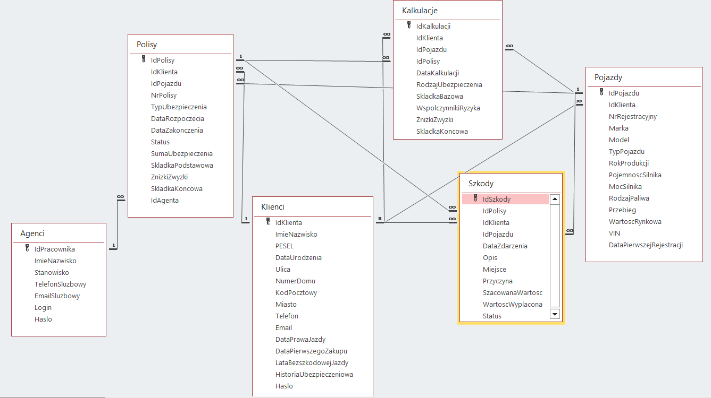
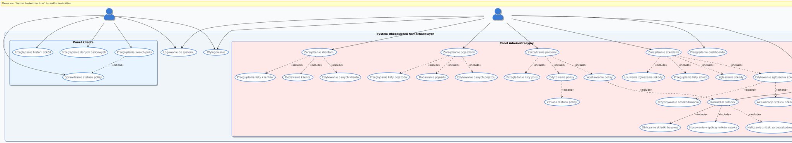

# Secure Auto Insurance Management System

## 🚗 Project Overview
This repository contains a full-stack web application built with PHP 8 and MySQL. It is designed to manage automotive insurance workflows, including client data, vehicle registries, policy generation, and claims processing. The core focus of this project is the implementation of robust database architecture, Secure Coding Practices, and Role-Based Access Control (RBAC).

## 🔒 Security Highlights (AppSec & DB Security)
To protect sensitive PII (such as National ID numbers and VINs), the following security mechanisms are enforced:

* **SQL Injection (SQLi) Prevention:** All database queries are executed using PHP Data Objects (PDO) with strict Prepared Statements.
* **Authentication & Password Management:** Passwords are cryptographically hashed using native PHP functions (`generate_hash.php`) before being stored in the database. Plain-text passwords are never saved.
* **Role-Based Access Control (RBAC):** 
  * **Client Panel (`client_panel.php`):** Restricted access allowing users to view only their own personal data, active policies, and claim history.
  * **Admin/Agent Panel (`admin_panel.php`):** Elevated privileges for staff to perform CRUD operations on clients, policies, and claims.
* **Secure Session Management:** Controlled session initialization and safe destruction (`logout.php`) to prevent session hijacking and unauthorized access.
* **Software Architecture:** The application follows the MVC (Model-View-Controller) design pattern principles to separate business logic from the presentation layer.

## 🗄️ Database Architecture & Business Logic
The foundation of this project is a highly normalized MySQL database designed for data integrity and optimized querying. 

### Key Entities & Relationships:
* **Clients:** The central entity holding PII, linked via one-to-many relationships to Vehicles and Policies.
* **Vehicles:** Contains technical specifications (e.g., engine power, year of manufacture) necessary for accurate risk assessment.
* **Policies & Claims:** Records of active coverage and historical incident reports.
* **Calculations Engine:** An automated risk-assessment module that calculates final insurance premiums based on claim-free history (up to a 60% discount), vehicle parameters, and past damages.

## 👥 Use Case & Operational Flows
The system provides distinct operational flows for different user types, ensuring strict privilege separation.

## 🛠️ Technology Stack
* **Backend:** PHP 8, PDO
* **Database:** MySQL
* **Frontend:** HTML5, CSS3, Vanilla JavaScript (Mobile-first responsive design)

## 📂 Repository Structure
* `/` - Core PHP application files (`index.php`, `admin_panel.php`, `client_panel.php`, `config.php`, `generate_hash.php`, `logout.php`).
* `database.sql` & `init.sql` - Database schema definitions and initialization scripts.
* `/docs` - Comprehensive project documentation:
  * `Business-Analysis.pdf` - Detailed system functionalities and business processes.
  * `Project-Description.pdf` - High-level system expectations and core objectives.
  * `General-List-of-Changes.pdf` - Feature changes and optimizations.
  * `Project-Presentation.pdf` - Architecture overviews and tech stack summary.
* `/assets` - Architecture diagrams (`UML.png`, `erd.png`).

> **Disclaimer:** Database configuration files (`config.php`) have been scrubbed of real credentials for security purposes. To run this project locally, please configure your own database credentials.